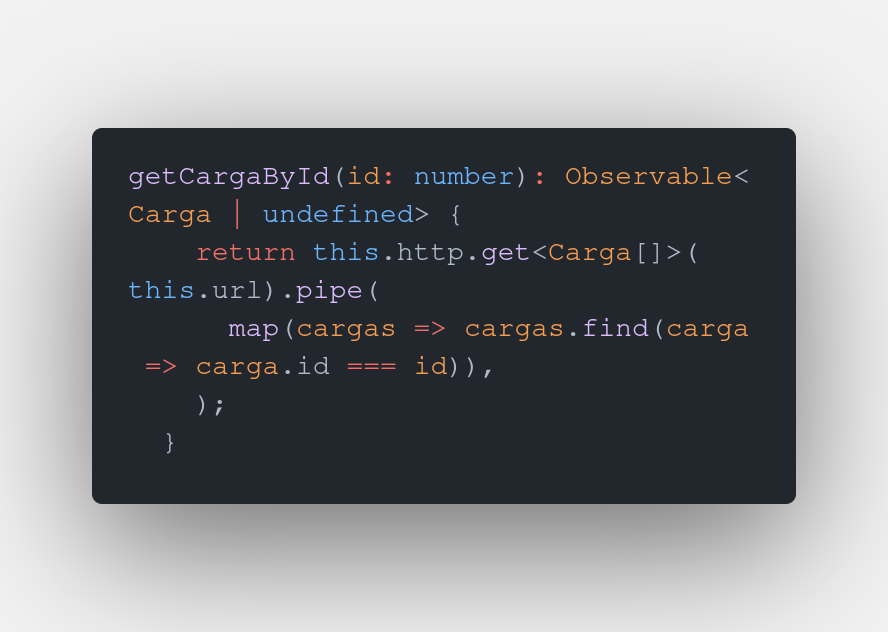
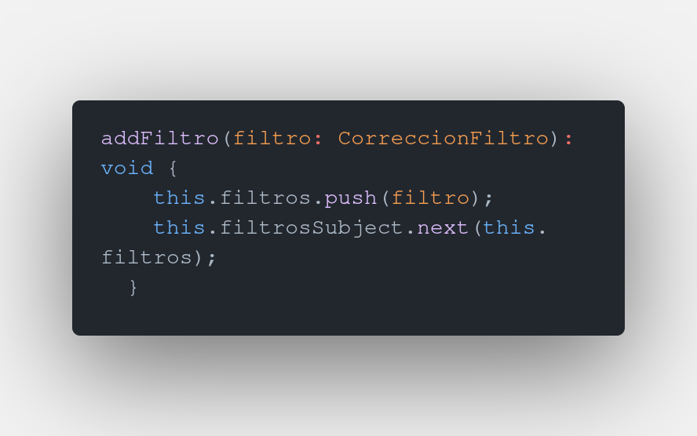

# IntegracionContable

This project was generated with [Angular CLI](https://github.com/angular/angular-cli) version 12.1.1.

## Development server

Run `ng serve` for a dev server. Navigate to `http://localhost:4200/`. The app will automatically reload if you change any of the source files.

## Code scaffolding

Run `ng generate component component-name` to generate a new component. You can also use `ng generate directive|pipe|service|class|guard|interface|enum|module`.

## Build

Run `ng build` to build the project. The build artifacts will be stored in the `dist/` directory.

## Running unit tests

Run `ng test` to execute the unit tests via [Karma](https://karma-runner.github.io).

## Running end-to-end tests

Run `ng e2e` to execute the end-to-end tests via a platform of your choice. To use this command, you need to first add a package that implements end-to-end testing capabilities.

## Further help

To get more help on the Angular CLI use `ng help` or go check out the [Angular CLI Overview and Command Reference](https://angular.io/cli) page.

# Angular

Angular es un framework para el desarrollo de aplicaciones web que trae de serie muchas de las funcionalidades necesarias para implementar un proyecto de este tipo, tales como navegación, formularios, cliente http, workers, tests, observables, etc. Solo siendo necesario agregar librerías para funcionalidad especializada como es el caso de material, momentjs o xlsx.

La versión en la que se trabajará el presente proyecto es la 12, que tiene poco tiempo de lanzamiento en la rama estable.

## 1. Conceptos Básicos

+ **Componentes**: Son los elementos básicos sobre los que se contruirá la aplicación, representan una porción de la vista. Se componen de un archivo Typescript, un archivo Html y un archivo Sass. Las propiedades que se declaren en la clase TS estarán disponibles el la plantilla del Html, incluyendo los propiedades especiales de entrada y salida.
+ **Servicios**: Son clases que brindan información a los componentes y se encargan de realizar las peticiones al servidor de datos mediante Api Rest y mantener datos que sobrevivan al ciclo de vida de un componente.
+ **Directivas**: Son clases definidas por Angular para añadir caracteristicas y comportamiento a las etiquetas html o componentes tales como ngIf, ngFor, formControlName, etc. Adicionalmente el framework nos permite implementar directivas personalizadas dependiendo de las funcionalidades que necesitemos.
+ **Guards**: Son clases que se utilizan en la definición de las rutas para discriminar el acceso entre los diferentes roles existentes.
+ **Interceptores**: Son clases que capturan una llamada a un servicio externo, se utilizan para añadir información, mostrar spinners de carga, capturar errores, logs, etc y en desarrollo se utilizarán como servidor de datos de prueba.
+ **Módulos**: Angular permite el encapsulamiento de funcionalidad del sistema por módulos que mantienen componentes, servicios, etc relacionados a un dominio de la aplicación.

## 2. Angular CLI

Angular provee de un cliente de comandos de consola para la creación de un proyecto, también permite la creación de los diferentes elementos del framework, módulos, componentes, directivas, etc. Asimismo se utiliza este cliente como servidor de pruebas, para generar builds y correr pruebas.

Para generar un nuevo proyecto se utiliza el siguiente comando:

`ng new integracion-contable --strict --skip-install`

Solo el nombre del proyecto es un parámetro obligatorio, --strict se utiliza para que el proyecto generado tenga checkeos de tipos de modo estricto y asi poder identificar errores al momento del compilado. --skip-install se utiliza para evitar que al momento de crear el proyecto se instalen las dependencias y así terminar la ejecución de la creación sin errores por posibles inconsistencias de dependencias.

## 2. Estructura

Sobre la estructura generada por Angular CLI, Se añaden módulos que agruparán elementos con funcionalidad relacionada.

**Shared**: Este módulo contendrá los elementos que van a ser utilizados en los demás módulos. Entre los elementos que contiene están las clases model y los enums.

`ng generate module shared --project=integracion-contable`

**Core**: Este módulo contiene los elementos generales de la aplicación como el layout, la barra superior o lateral, así como los servicios que serán utilizados por los demás módulos, estos se  incluyen aquí porque serán proveídos en la raíz del árbol de inyecciones. También contendrá las directivas personalizadas que se construyan.

`ng generate module core --project=integracion-contable --module=app`

## 3. Rutas

Al crear la aplicación se incluye el manejo de rutas provisto por Angular. Para navegar a otra página se utliza routeLink en la plantilla o el método navigate del router en la clase TS, en ambos casos se pueden agregar params o queries a la ruta destino.

Ejemplo de navegación en la plantilla con params:

Ejemplo de navegación en la plantilla con query:

## 4. Material

Uno de los primeros después de la creación de la aplicación es incluir las dependencias de angular material para poder utilizar sus componentes y directivas en los componentes de la aplicación.

`ng add @angular/material`

Se debe crear el módulo material.module.ts que declarará y exportará todos los componentes material, luego este módulo se importará en aquellos módulos que necesiten acceder a los componentes de material.

## 5. RxJS

Se utilizá la programación reactiva para poder manejar los datos que llegán desde el api rest de forma asíncrona. Estas peticiones se ejecután al momento que un componente se suscribe a un Observable que notificará con la información solicitada cuando esta este lista.

En este caso el método subscribe ejecuta la función getCargas que realiza la petición de la lista de cargas al servidor api rest y cuando la lista llega en data carga los valores en la propiedad respectiva del componente para que sean renderizados en la vista. Adicionalmente subscribe admite dos parámetros más, uno para ejecutar una acción en caso de error y otra para ejecutar una acción cuando el stream de datos este completo.

Las peticiones http al servidor api rest también devuelven observables que vamos a consumir en los componentes, en el ejemplo se agrega el método pipe cuya función es ejecutar operaciones a los datos recibidos desde el servidor antes de pasarlos al componente suscrito. En el ejemplo se recibe una lista de cargas y la función map realiza un filtrado para solo devolver la carga solicitada mediante su id.

Es importante saber que cada subscripción a un observable ejecuta una instancia diferente de esta por lo que cada subscripción recibirá su propia información cuando su observable le notifique. Para modificar este comportamiento y tener algo parecido a un broadcast de datos, esto es un solo observable que notifique a todos los suscritos que tenga se utiliza la característica de Subject.

Un subject es un clase que implementa las funciones de un observable y un observer al mismo tiempo, por lo que se puede utilizar como propiedad de un servicio y devolverlo como observable a los componentes que requieran esa información y luego alterar la información que contiene para notificar a todos los componentes suscritos.

Se devuelve el subject como observable.

La función addFiltro recibe un filtro, la agrega a la lista de filtros y luego con la función next del subject notifica a todos los componentes suscritos.

## 6. Formularios

Angular permite el manejo de los formularios de dos modos diferentes, en la aplicación uso el método de reactive forms, por ello debo declarar los controles que incluye el FormGroup en la clase TS del componente respectivo.

En la declaración del FormControl puedo incluir un valor inicial que puede ser utilizado como valor por defecto o como valor cargado o pasado.

Más adelante se podrá agregar la opción de validar los campos de los formularios y conjuntamente con material darle el feedback al usuario.

## 7. Convenciones

Angular utiliza el tipo de archivo para especificar que clase de elemento es, esta tipo va entre el nombre y la extensión del archivo, por ejemplo en un archivo llamado dashboard.component.ts la palabra component nos especifica que el archivo contiene un componente. A parte de los generados por Angular CLI, en el proyecto se han utilizado los siguientes tipos:

+ model: Para las interfaces y clases que modelizan los modelos.
+ enum: Para las clases enum.
+ response: Para mapear las respuestas del api rest.

## 8. Despliegue

Para desplegar en Azure, se debe tener creado un resource group, un web service plan y el web service donde se alojará la aplicación.

Azure nos ofrece dos formas en las que se puede desplegar la aplicación, la primera es vincular un repositorio de código alojado en Github, Bitbucket u otro servicio similar, el repositorio debe contener un archivo de tipo configuración del pipeline para la contrucción del despliegue específico para Azure para lo cual se necesitan algunas credenciales como APPLICATION_ID y TENANT_ID.

La segunda opción es cargar los archivos de la aplicación mediante FTPS y es la que se utilizó para el presente despliegue. A continuación describimos los pasos seguidos:

+ Hay que ejecutar el comando `ng build` para que Angular Cli construya la build de producción de nuestra aplicación.

+ En http://portal.azure.com nos logueamos con las credenciales proporcionadas. Una vez autenticados nos vamos a la sección de App Services y luego seleccionamos nuestra aplicación, 02p-fahwebapp-d01.}

+ A continuación se creo un slot en la opción de Deployment slots, esto para tener un espacio para la carga de la aplicación para desarrollo, el slot de desarrollo es 02p-fahwebapp-d01-develop.
+ Luego con nuestro slot seleccionado, en Configuration en la sección de General Settings se seleccionó el stack php como servidor web.
+ Para desplegar los archivos mediante FTPS debemos obtener las credenciales de conexión para ello vamos a Deployment Center y en la opción de FTPS Credentials copiamos la url, el usuario y la contraseña.

+ Con las credenciales, nos conectamos desde un cliente FTP, en mi caso he usado Filezilla.

+ Una vez conectados, subimos el contenido de la carpeta dist/integracion-contable a la carpeta wwwroot del servidor remoto.

+ Eso es todo, con esto ya deberiamos tener desplegado la aplicación y se puede acceder desde la url que obtenemos en la sección Overview de nuestro slot de desarrollo.

